<picture>
  <source media="(prefers-color-scheme: dark)" srcset="assets/banner-dark.svg">
  <source media="(prefers-color-scheme: light)" srcset="assets/banner-light.svg">
  
</picture>

  
  
  
  

---

I build AI systems that do real work — and the platform underneath that keeps them honest.

Most of what I ship lives in private repositories. Here's the shape of it.

## Applied AI

**Multi-agent orchestration.** A coordinator that runs several CLI agents in parallel: each one isolated in its own workspace, so closing one never destroys another's work. Session-scoped tokens stop one agent from forging commands as another, and the command surface is an allowlist — read verbs by default, writes by exception. Approval travels back to the coordinator inside the same turn, not on the next poll.

**Cost engineering for LLMs.** Model tiering per task, measured instead of assumed. Cheap models do the mechanical work; the expensive tier is reserved for adversarial verification, where it actually pays. An audit of real usage found most of the spend hiding in orchestration that nobody had instrumented.

**AI-assisted code quality.** A quality gate that reads SARIF, grades A–E and decorates the pull request — no SonarQube server to run. Named after ἔλεγχος: the examination that proves a claim by trying to refute it.

**On-device inference.** Face recognition on Android, with the model pulled out of the APK and downloaded on demand — 23 MB lighter, and the app handles the model simply not being there.

**Memory and context engineering.** Persistent memory across sessions, linked as a graph rather than a flat log, so a decision made weeks ago is still reachable when it matters.

## Engineering

**Native Android** — Kotlin, Jetpack Compose. Offline-first: the places these apps run have bad signal and the phone is the only interface.

**Web platforms** — TypeScript over Postgres. Multi-tenant, role-based access, audit trails that survive the question *who changed this, and when*.

**Services and integrations** — C#/.NET and Python. Third-party APIs, background processing, ETL, and the unglamorous work of making two systems that were never meant to talk agree on a contract.

**Developer platform** — reusable CI shared across repositories, dependency automation, and a runtime migration of 25+ actions completed ahead of the deprecation deadline rather than after it.

## How I work

Merging to `main` does not deploy. A person approves the release and the approval is recorded with the run — fail-closed, because a pipeline that ships on green alone will eventually ship on a green that lied.

Every pull request links to a task, and a required check blocks the merge when it doesn't. A gate beats discipline.

I verify before I assert. A blocked port, a full disk, a service that's down — if I haven't tested it today, it isn't a fact, it's a memory.

## Stack

  
  
  
  
  

  
  
  
  
  
  

  
  
  
  
  

## Open work

**[friday_agents](https://github.com/LucasEdu07/friday_agents)** — local agent framework in Python: persistent memory, image analysis, API integration. Modular and offline-ready. It's where the ideas above started.

The other public repositories are earlier ground — CRM, inventory, an OBD-II reader for car diagnostics. They stay public on purpose; the trajectory is part of the work.

---

  
  

  

