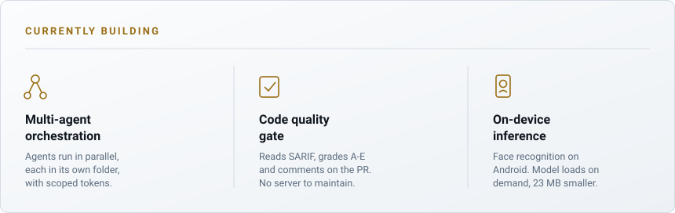

<picture>
  <source media="(prefers-color-scheme: dark)" srcset="assets/banner-dark.svg">
  <source media="(prefers-color-scheme: light)" srcset="assets/banner-light.svg">
  
</picture>

  
  
  
  

---

Agents that coordinate other agents, quality gates that fail the build, face recognition running on the phone instead of a server.

Most of it is in private repositories, so here's the work rather than the repos.

## AI

**Multi-agent orchestration** — a coordinator that runs several AI agents at the same time. Each agent works in its own isolated folder, so closing one never deletes another's work. Tokens are scoped per session, which stops one agent from running commands as another.

**LLM cost control** — an audit of real usage found 98% of the model spend on the most expensive tier, and 92% of that inside orchestration nobody had instrumented. Every stage now declares which tier it runs on, and the expensive one is kept for the checks where a wrong answer costs more than the call.

**Code quality gate** — reads SARIF output from static analysis, grades the code A–E and comments on the pull request. No SonarQube server to maintain.

**On-device inference** — face recognition on Android. I moved the model out of the app bundle and download it on demand. The app is 23 MB smaller and still works before the model arrives.

**Persistent memory** — context that survives between sessions, stored as a linked graph. A decision made six weeks ago is still reachable when the same question comes back, instead of being made again from scratch.

## Engineering

The systems the AI work sits on top of. Multi-tenant web platforms in TypeScript and Postgres, where several companies share one deployment and every change is attributable. C# and Python services moving data between APIs that were never designed to meet. Android apps in Kotlin and Compose, built for warehouses and job sites where the network drops mid-request and the phone is the only device anyone has.

The platform work came out of that: CI shared across repositories, dependency updates that merge themselves when green, and a runtime migration of 25+ actions finished before the deadline rather than after it.

## What I don't build

The interesting part is rarely the part you build. Queues, roles, canned replies, dashboards — that already exists under a permissive license, and rebuilding it costs weeks nobody has.

I'd rather spend those weeks on the piece nobody can sell you: the one wired to data only that company has.

## How I work

Merging to `main` doesn't deploy. A person approves each release, and the approval is recorded with the run.

Every pull request links to a task. A required check blocks the merge when it doesn't.

Before I report that something is broken, I test it again. More than once the problem had already been fixed and nobody had rechecked.

## Stack

  
  
  
  
  

  
  
  
  
  
  

  
  
  
  
  

---

  <picture>
    <source media="(prefers-color-scheme: dark)" srcset="assets/focus-dark.svg">
    <source media="(prefers-color-scheme: light)" srcset="assets/focus-light.svg">
    
  </picture>

  

